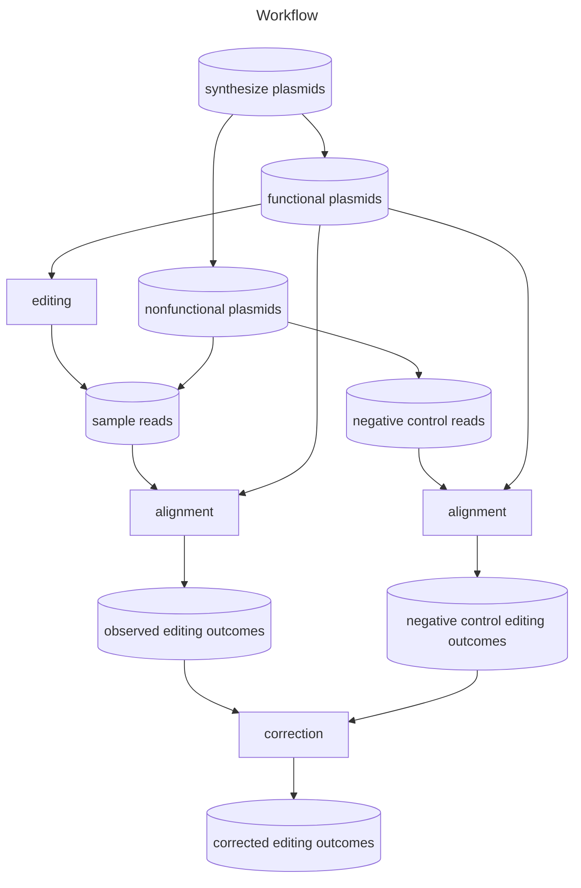

# Introduction



We design the workflow `naapam` to decouple the CRISPR/Cas9 editing outcomes from the synthesis error of reference plasmids. We first give an overview of the workflow and left the techniqal details in [Discriminate functional and nonfunctional plasmids](#discriminate-functional-and-nonfunctional-plasmids), [Sequence alignment](#sequence-alignment) and [Correction observed editing outcomes by negative control](#correction-observed-editing-outcomes-by-negative-control).

As shown in the above diagram, we apply the hard classification on the synthesized plasmids to get functional and nonfunctional plasmids. We assume that only functional plasmids can be edited by the CRISPR/Cas9 system. Nonfunctional plasmids are transferred into the cell lines, but are not edited. Based on our assumption that only functional plasmids can be edited, we use functional plasmids as references to analyze editing outcomes.

For cell lines express Cas9, both nonfunctional plasmids and edited functional plasmids contribute to the editing outcomes in NGS reads. For the negative control (cell lines without Cas9), only nonfunctional plasmids contributes to the editing outcomes. The synthesis of plasmids is error-prone. A naive analysis often attributes these synthesis errors to the CRISPR/Cas9 system, and therefore overesitimates the editing efficiency and distorts the overall editing profile. A reasonable assumption is that the abundance of non-functional plasmids is similar in cell lines with and without Cas9. Therefore, we may correct the editing profiles for the cell lines with Cas9 based on those of the negative controls.

## Discriminate functional and nonfunctional plasmids


We parse the components for each read in control samples. We discriminate functional and nonfunction plasmids based on the integrity and conservation of:

- primer;
- sgRNA;
- scaffold; 
- barcode;
- protospacer;
- PAM;
- transcription start and end sites markded by G;

We also require that barcode, sgRNA, protospacer are consistent (comes from the same plasmid design).

## Sequence alignment

We use the bioconda package `rearr` (version 1.0.11) to align the NGS reads to the functional plasmids for discriminating their editing types. We package `rearr` together with `naapam` so you need not download it separately. `Rearr` use an efficient and accurate chimeric alignment engine to call editing outcome from raw reads. It is especially good at extracting predictable templated insertions resulted from stagger cleavage of CRISPR/Cas9 system [(Precise and Predictable CRISPR Chromosomal Rearrangements Reveal Principles of Cas9-Mediated Nucleotide Insertion)](https://doi.org/10.1016/j.molcel.2018.06.021). See the [documentation](https://ljw20180420.github.io/rearr/) for more details about `rearr`.

## Correction observed editing outcomes by negative control

Let $w_0$ be the observed wild type frequency of a functional plasmid in control sample. Let $e_0^{(i)}$ be the observed frequency of editing outcome $i$ (actually nonfunctional plasmids) in control sample. Then $w_0 + \sum_i e_0^{(i)} = 1$. Similarly, let $w$ be observed the wild type frequency of a functional plasmid in the sample with Cas9. Let $e^{(i)}$ be the observed frequency of editing outcome $i$ in the sample with Cas9. Then $w + \sum_i e^{(i)} = 1$. By the assumption that the abundance of non-functional plasmids is similar in cell lines with and without Cas9, the expected frequency of functional plasmids (wild type + edited) is $w_0$. For the editing outcome $i$, among its observed frequency $e^{(i)}$ in the cell line with Cas9, we expect that $e_0^{(i)}$ comes from nonfunctional plasmids. In summary, the corrected frequency of the editing outcome $i$ is
$$
\frac{e^{(i)} - e_0^{(i)}}{w_0}
$$
if wild type is included, and
$$
\frac{e^{(i)} - e_0^{(i)}}{\sum_i (e^{(i)} - e_0^{(i)})}
$$
if wild type is excluded. This method has been used in previous works [High-throughput analysis of the activities of xCas9, SpCas9-NG and SpCas9 at matched and mismatched target sequences in human cells](https://doi.org/10.1038/s41551-019-0505-1) and [Prediction of the sequence-specific cleavage activity of Cas9 variants](https://doi.org/10.1038/s41587-020-0537-9).

# Install

```shell
$ pip install naapam
```

# Dependencies

- bowtie2
- gawk

# Usage

Follow the notebooks in order:

- `align.ipynb`
- `analysis.ipynb`

Copy them out of the package by
```python
from importlib import resources
import shutil

for file in ["align.ipynb", "analyze.ipynb"]:
    shutil.copyfile(src=resources.files("naapam.notebooks") / file, dst=file)
```
You need to config the directory and the plasmid file in the first block of the notebooks.

- `data_dir`: contains the raw NGS reads.
- `root_dir`: root directory for outputs.
- `plasmid_file`: the design file of plasmids.
- `config_dir`: directory for config files.
- `correct_dir`: output directory of the corrected alignment results.

Copy examples of plasmid files out of the package for reference.
```python
from importlib import resources
import shutil

for file in [
    "final_hgsgrna_libb_all_0811-NGG.csv",
    "final_hgsgrna_libb_all_0811_NAA_scaffold_nbt.csv",
]:
    shutil.copyfile(src=resources.files("naapam.plasmids") / file, dst=file)
```

Copy examples of config directory out of the package for reference.
```python
from importlib import resources
import shutil

shutil.copytree(src=resources.files("naapam.filter_configs"), dst="filter_configs")
```
